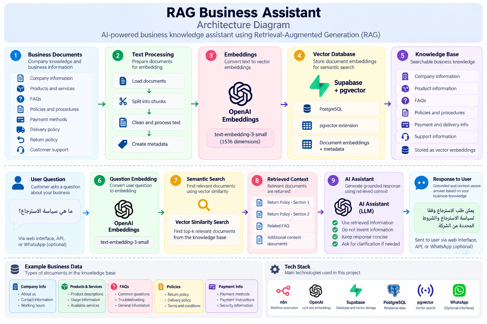

# 🧠 RAG Business Assistant

An AI-powered business knowledge assistant built with **Retrieval-Augmented Generation (RAG)**.

The system connects an AI assistant to a structured business knowledge base, retrieves relevant information using semantic search, and uses the retrieved context to generate grounded responses.

> **Focus:** RAG architecture, semantic search, embeddings, vector databases, and grounded AI responses.

---

## 🎯 Project Overview

Large Language Models can generate useful answers, but they do not automatically know a company's internal information.

This project demonstrates how to connect an AI assistant to business-specific knowledge using a **Retrieval-Augmented Generation pipeline**.

Instead of relying only on the model's general knowledge:

```text
User Question
      ↓
Generate Embedding
      ↓
Semantic Search
      ↓
Retrieve Relevant Documents
      ↓
Build Context
      ↓
AI Agent / LLM
      ↓
Grounded Response
```

---

## 🔍 What This Project Demonstrates

* Retrieval-Augmented Generation (RAG)
* Text embeddings
* Semantic search
* Vector similarity search
* Knowledge-base design
* Context retrieval
* Grounded AI responses
* Separation of knowledge and operational data
* Workflow automation with n8n
* Supabase + PostgreSQL + pgvector
* AI integration through APIs

---

## 🏗️ RAG Architecture

```text
                    BUSINESS KNOWLEDGE
                           │
                           ▼
                  ┌─────────────────┐
                  │    Documents    │
                  └────────┬────────┘
                           │
                           ▼
                  ┌─────────────────┐
                  │ Text Processing │
                  └────────┬────────┘
                           │
                           ▼
                  ┌─────────────────┐
                  │    Embeddings   │
                  │     OpenAI      │
                  └────────┬────────┘
                           │
                           ▼
                  ┌─────────────────┐
                  │    Supabase     │
                  │    pgvector     │
                  └────────┬────────┘
                           │
                    Vector Search
                           ▲
                           │
                  ┌────────┴────────┐
                  │  User Question  │
                  └────────┬────────┘
                           │
                           ▼
                  ┌─────────────────┐
                  │ Retrieve Top-K  │
                  │    Context      │
                  └────────┬────────┘
                           │
                           ▼
                  ┌─────────────────┐
                  │    AI Agent     │
                  └────────┬────────┘
                           │
                           ▼
                  ┌─────────────────┐
                  │ Grounded Answer │
                  └─────────────────┘
```

---


## 📚 Knowledge Base

The RAG knowledge base can contain relatively stable business information such as:

* Company information
* Products and services
* Frequently asked questions
* Payment methods
* Delivery policies
* Return policies
* Customer support information
* Business rules and procedures

The documents are converted into embeddings and stored in a vector database for semantic retrieval.

---

## 🔎 Semantic Search

The system does not depend on exact keyword matching.

A user's question is converted into an embedding and compared with the stored document embeddings.

This allows the system to retrieve information that is **semantically related** to the question, even when the wording is different.

```text
User Question
      ↓
Embedding
      ↓
Vector Similarity Search
      ↓
Relevant Documents
      ↓
Context
```

---

## 🧩 Knowledge vs. Operational Data

A key design decision is separating **business knowledge** from **live operational data**.

### Knowledge → RAG

Suitable for relatively stable information:

```text
Company Information
FAQs
Policies
Payment Methods
Return Policy
Service Information
Delivery Policy
```

### Operational Data → Database / Tools

Frequently changing information should be retrieved directly from structured data:

```text
Stock
Orders
Customers
Product Availability
Delivery Fees
Transactions
```

This separation reduces the risk of using outdated operational information as static AI knowledge.

---

## 💬 Example

### User Question

```text
ما هي سياسة الاسترجاع؟
```

### Retrieval

```text
Question
   ↓
Embedding
   ↓
Vector Search
   ↓
Return Policy Document
```

### Retrieved Context

```text
Return Policy

Customers can request a return according to
the company's return conditions.
```

### AI Response

```text
يمكن طلب الاسترجاع وفقًا لسياسة الاسترجاع
والشروط المحددة من الشركة.
```

The response is generated using the retrieved business context rather than relying only on the model's general knowledge.

---

## 🔄 Automation Workflow

The RAG pipeline can be orchestrated using n8n:

```text
User Question
      ↓
n8n
      ↓
Generate Embedding
      ↓
Query Vector Database
      ↓
Retrieve Relevant Context
      ↓
Build AI Prompt
      ↓
LLM / AI Agent
      ↓
Generate Response
```

---

## 📱 Optional WhatsApp Interface

WhatsApp can be used as a conversational interface:

```text
Customer
   ↓
WhatsApp
   ↓
Evolution API
   ↓
n8n
   ↓
RAG Pipeline
   ↓
AI Agent
   ↓
Response
   ↓
WhatsApp
```

WhatsApp is treated as an **interface layer**, while the core project remains focused on RAG and knowledge retrieval.

---

## 🛠️ Tech Stack

| Technology        | Purpose                          |
| ----------------- | -------------------------------- |
| **n8n**           | Workflow orchestration           |
| **OpenAI**        | LLM and embeddings               |
| **Supabase**      | Database and vector storage      |
| **PostgreSQL**    | Structured data                  |
| **pgvector**      | Vector similarity search         |
| **Evolution API** | Optional WhatsApp integration    |
| **RAG**           | Knowledge retrieval architecture |
| **REST APIs**     | System integration               |
| **Webhooks**      | Event-driven workflows           |

---

## 🧠 Design Principles

### 1. Retrieve Before Generating

Relevant business information should be retrieved before generating a response.

### 2. Ground Responses in Retrieved Context

The AI should use the retrieved information when answering company-specific questions.

### 3. Do Not Invent Business Information

If the required information cannot be found, the assistant should not fabricate an answer.

### 4. Separate Knowledge from Live Data

RAG is used for business knowledge, while structured tools and database queries handle frequently changing information.

### 5. Maintainable Knowledge Base

Business information should be organized so that documents can be updated without changing the core AI workflow.

---

## 🔐 Security

This repository is intended for portfolio demonstration.

Never commit:

* API keys
* Database passwords
* Webhook secrets
* WhatsApp credentials
* Private business information
* Real customer data

Credentials should be managed using secure credential storage, environment variables, or secret management systems.

---

## 📁 Suggested Project Structure

```text
RAG-Business-Assistant/
│
├── README.md
│
├── database/
│   └── schema.sql
│
├── prompts/
│   └── rag-system-prompt.md
│
├── workflows/
│   └── README.md
│
└── docs/
    └── architecture.md
```

---

## 🎯 Project Purpose

This project demonstrates how **RAG can connect AI assistants to private business knowledge**.

The primary focus is the architecture behind:

**Documents → Embeddings → Vector Search → Retrieved Context → AI Response**

It is designed as a portfolio project demonstrating practical knowledge of **RAG, AI agents, vector databases, and workflow automation**.

---

### Built by Alia Abuzaid

**AI Automation Developer | AI Agents | n8n | RAG | Business Automation**
